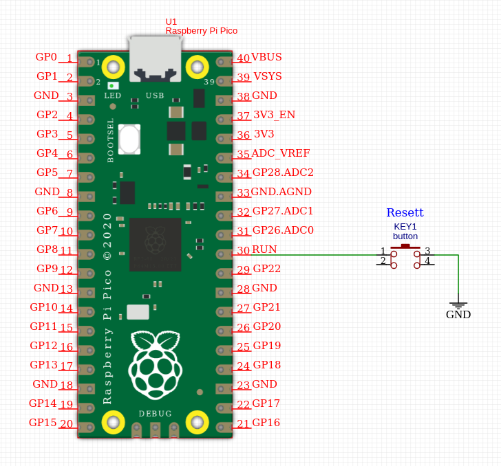

# Katsed Raspberry Pi pico'ga

- Laealla **pico-sdk**
  
  ```Bash
  cd~
  mkdir pico
  cd pico
  git clone -b master https://github.com/raspberrypi/pico-sdk.git
  cd pico-sdk
  git submodule update --init
  cd ..
  git clone -b master https://github.com/raspberrypi/pico-examples.git
  ```

- Paigalda vajalikud tööriistad (_toolchain_)

  ```Bash
  sudo apt update
  sudo apt install cmake gcc-arm-none-eabi libnewlib-arm-none-eabi build-essential
  ```

- Paigalda Visual Studio Code ja pluginad

  ```Bash
  code --install-extension marus25.cortex-debug
  code --install-extension ms-vscode.cmake-tools
  code --install-extension ms-vscode.cpptools
  ```

- PICO_SDK_PATH

~/.profile faili lisada tee failidee SDK juurde. Näiteks:

```Bash
export PICO_SDK_PATH="/home/taunoerik/pico/pico-sdk"
```

- VSCode käivitamisel

Valida "Yes" to configure the project. Ja valida **GCC for arm-none-eabi**

## Oma projekti ehitamine

Tee kataloog pico-sdk kõrvale.
Failid projektinimi.c või projektinimi.cpp ja CMakeLists.txt fail.
Then copy the pico_sdk_import.cmake file from the external folder in your pico-sdk installation to your test project folder.

  ```Bash
  mkdir build
  cd build
  cmake ..
  make
  ```

Faili **.uf2** saab tirida otse Picole, programmi käivitamiseks.

## minicom

Paigalda:

    sudo apt install minicom

Kasuta (USB kaudu):

    minicom -b 115200 -o -D /dev/ttyACM0

minicomis väljumine: CTRL+A ja X

## Resett nupp



## Juhendid

- [Getting started with Raspberry Pi Pico](https://datasheets.raspberrypi.org/pico/getting-started-with-pico.pdf) C/C++ development with Raspberry Pi Pico and other RP2040-based microcontroller boards.
- [Raspberry Pi Pico C/C++ SDK](https://datasheets.raspberrypi.org/pico/raspberry-pi-pico-c-sdk.pdf) Libraries and tools for C/C++ development on RP2040 microcontrollers

 ___

Copyright 2021 Tauno Erik https://taunoerik.art
