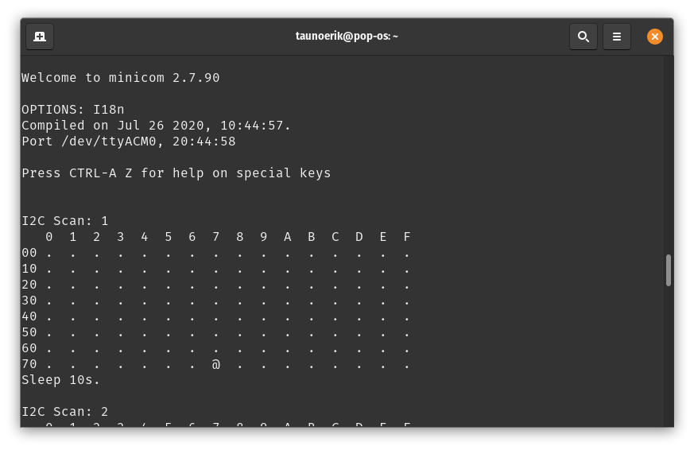

# i2c scanner

Build:

```Bash
$ mkdir build && cd build
$ cmake ..
$ make
```

Results over minicom:

```Bash
$ minicom -b 115200 -o -D /dev/ttyACM0
```



 ___

Copyright 2021 Tauno Erik https://taunoerik.art